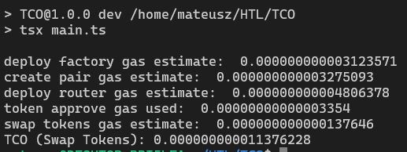

# TCO

## Running Locally

### Prerequisites

- Wallet with minimal **BNB tokens** for gas and allowance calls
- At least **0.1 USDC** on BNB Chain for gas estimation

---

### Setup Steps

1. **Clone the repo**

   ```sh
   git clone <repository-url>
   cd <repository-folder>
   ```

2. **Install root dependencies**

   ```shell
      pnpm install
   ```

3. **Navigate to contracts folder**

   ```shell
    cd contracts/exchange-protocol
   ```

4. **Install contracts dependencies**

   ```shell
      pnpm install
   ```

5. **Compile smart contracts**

   ```shell
      npx hardhat compile
   ```

   _Note: Steps 3-5 are not yet fully tested._

6. **Create `.env` in root and add your private key:**

   ```shell
    PRIVATE_KEY=your_private_key_here
   ```

7. **Return to the root folder:**

   ```shell
      cd ../..
   ```

8. **Run development server on BNB Chain:**
   ```shell
      pnpm dev:bnb2
   ```

---

## Supported Chains

- Currently supports **BNB Chain** only
- More chains coming soon

---

## Example Output



## Troubleshooting

### INSUFFICIENT_OUTPUT_AMOUNT: Swap Fails Due to `amountOutMin` Value.

If your script fails during the swap estimation or execution step with an error related to the output amount, it is likely caused by an invalid or outdated value for the `amountOutMin` parameter in the code. This value should reflect the current minimum amount receivable for the token pair (taking slippage into account).

**How to fix:**

- Check the current exchange rate and minimum output on PancakeSwap or the DEX you are interacting with.
- Adjust the `amountOutMin` value in the script accordingly (e.g., update `parseUnits('x.xxxxxx', 18)` to match realistic market conditions).
- Re-run the script.

> **Tip:** If the estimated output is lower than your specified `amountOutMin`, the transaction will not proceed. Keeping `amountOutMin` up to date is essential for successful execution, especially on mainnet where market conditions may change frequently.
