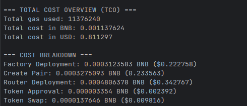

# TCO

## Running Locally

### Prerequisites
- Wallet with minimal **BNB tokens** for gas and allowance calls
- At least **0.1 USDC** on BNB Chain for gas estimation

---

### Setup Steps

1. **Clone the repo** 
    ```  sh 
    git clone <repository-url>  
    cd <repository-folder>
    ```

2. **Install root dependencies**
    ```shell
       pnpm install
    ```

3. **Navigate to contracts folder**  
   ```shell
    cd contracts/exchange-protocol
    ```

4. **Install contracts dependencies**  
    ```shell
       pnpm install
    ```

5. **Compile smart contracts**
    ```shell
       npx hardhat compile
    ```
   *Note: Steps 3-5 are not yet fully tested.*

6. **Create `.env` in root and add your private key:**  
   ```shell
    PRIVATE_KEY=your_private_key_here
    ```

7. **Return to the root folder:**  
    ```shell
       cd ../..
    ```

8. **Run development server on BNB Chain:**  
    ```shell
       pnpm dev:bnb2
    ```

---

## Supported Chains

- Currently supports **BNB Chain** only
- More chains coming soon

---

## Example Output


